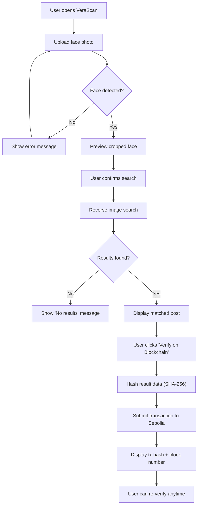
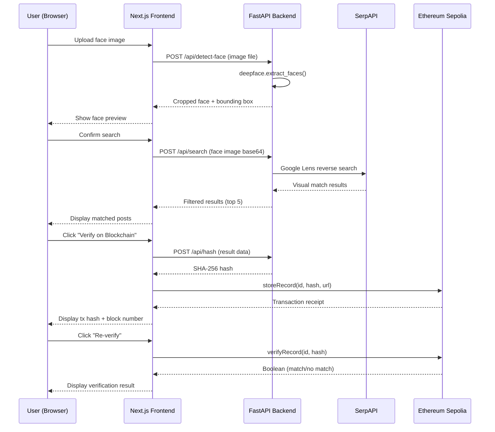

# VeraScan — Product Requirements Document

**Version**: 1.0
**Date**: September 4, 2026
**Project**: HH Goa 2026 — Task 3: Face Identification & Blockchain Verification
**Deadline**: September 7, 2026, 11:59 PM IST

---

## 1. Product Overview

### 1.1 What is VeraScan?

VeraScan is a face-to-blockchain verification pipeline. It takes a photograph of a person's face, searches the open web for matching social media content, and creates a tamper-proof record of the discovered data on the Ethereum blockchain.

The pipeline answers one question: **"Does this face appear anywhere online, and can we prove what we found?"**

### 1.2 Why does it matter?

Digital identity verification is increasingly relevant in contexts like hiring, journalism, law enforcement, and trust-building on platforms. VeraScan demonstrates a proof-of-concept for linking a physical face to a digital footprint with blockchain-backed evidence that cannot be altered after the fact.

### 1.3 Core Pipeline

```
Input (face photo) → Face Detection → Reverse Image Search → Result Packaging → Blockchain Storage → Verification
```

This is not a social media monitoring tool, not a surveillance product, and not a facial recognition database. It is a single-use pipeline that searches, records, and verifies.

---

## 2. User Flow

### 2.1 Primary Flow (Happy Path)

```
Step 1:  User opens VeraScan in their browser
Step 2:  User uploads a photo containing a human face
Step 3:  System detects the face, crops it, and shows a preview
Step 4:  User confirms and triggers the search
Step 5:  System performs a reverse image search across the web
Step 6:  System displays the matched social media post(s) — image, text, source URL
Step 7:  User reviews the results
Step 8:  User clicks "Verify on Blockchain"
Step 9:  System hashes the result data (SHA-256) and submits a transaction to Ethereum Sepolia
Step 10: System displays the transaction hash, block number, and a "Verify" button
Step 11: User can re-verify at any time by clicking "Verify" — system compares the local hash against the on-chain record
```

### 2.2 Edge Cases

| Scenario | Behavior |
|---|---|
| No face detected in uploaded image | Show clear error: "No face detected. Try a different photo." |
| Multiple faces detected | Use the largest/most prominent face. Show which face was selected. |
| No search results found | Show: "No matching content found on the web." Do not proceed to blockchain step. |
| Search API rate limit hit | Show: "Search temporarily unavailable. Try again in a few minutes." |
| Blockchain transaction fails | Show error with transaction details. Allow retry. |
| User uploads non-image file | Reject with: "Please upload a JPG, PNG, or WebP image." |
| Image too small (< 100x100px) | Reject with: "Image is too small for reliable face detection." |

### 2.3 User Flow Diagram



---

## 3. Technical Architecture

### 3.1 System Architecture

```
┌─────────────────────────────────────────────────────┐
│                 BROWSER (Client)                    │
│                                                     │
│  Next.js 14 App Router                              │
│  ├── Upload Page (face input + preview)             │
│  ├── Results Page (matched posts)                   │
│  ├── Verification Page (blockchain proof)           │
│  ├── Privacy Policy / Terms pages                   │
│  └── ethers.js v6 (blockchain interaction)          │
└───────────────────┬─────────────────────────────────┘
                    │ HTTP (REST API)
┌───────────────────▼─────────────────────────────────┐
│              BACKEND (API Server)                   │
│                                                     │
│  Python FastAPI                                     │
│  ├── /api/detect-face     (face detection)          │
│  ├── /api/search          (reverse image search)    │
│  ├── /api/hash            (SHA-256 hashing)         │
│  └── /api/health          (health check)            │
│                                                     │
│  Libraries:                                         │
│  ├── opencv-python (face detection + image processing)           │
│  ├── serpapi (Google Lens reverse search)            │
│  ├── Pillow (image processing)             │
│  └── hashlib (SHA-256)                              │
└───────────────────┬─────────────────────────────────┘
                    │
┌───────────────────▼─────────────────────────────────┐
│           BLOCKCHAIN (Ethereum Sepolia)             │
│                                                     │
│  VeraScan.sol Smart Contract                        │
│  ├── storeRecord(id, dataHash, sourceUrl)           │
│  ├── verifyRecord(id, dataHash) → bool              │
│  └── getRecord(id) → Record struct                  │
│                                                     │
│  Access via: Alchemy RPC (free tier)                │
└─────────────────────────────────────────────────────┘
```

### 3.2 Tech Stack

| Layer | Technology | Version |
|---|---|---|
| Frontend Framework | Next.js (App Router) | 14.x |
| UI Library | React | 18.x |
| Animation | Framer Motion | 11.x |
| Styling | Vanilla CSS (custom design system) | -- |
| Typography | Google Fonts (Inter + Space Grotesk) | -- |
| Backend Framework | FastAPI | 0.100+ |
| Face Detection | OpenCV Haar Cascades | -- |
| Image Processing | Pillow | latest |
| Reverse Search | SerpAPI (Google Lens) | REST API |
| Hashing | hashlib (stdlib) | Python 3.11+ |
| Smart Contract Language | Solidity | 0.8.19+ |
| Web3 Client | ethers.js | 6.x |
| Blockchain Network | Ethereum Sepolia Testnet | -- |
| RPC Provider | Alchemy | Free tier |
| Package Manager (JS) | npm | -- |
| Package Manager (Python) | pip / venv | -- |

### 3.3 Repository Structure

```
VeraScan/
├── frontend/                    # Next.js application
│   ├── app/
│   │   ├── layout.js
│   │   ├── page.js              # Landing / Upload page
│   │   ├── results/
│   │   │   └── page.js          # Search results display
│   │   ├── verify/
│   │   │   └── page.js          # Blockchain verification
│   │   ├── privacy/
│   │   │   └── page.js          # Privacy policy
│   │   └── terms/
│   │       └── page.js          # Terms & conditions
│   ├── components/
│   │   ├── FaceUploader.js
│   │   ├── FacePreview.js
│   │   ├── PipelineStepper.js
│   │   ├── SearchResult.js
│   │   ├── BlockchainProof.js
│   │   ├── VerificationBadge.js
│   │   └── Footer.js
│   ├── lib/
│   │   ├── blockchain.js        # ethers.js contract interaction
│   │   ├── api.js               # FastAPI client
│   │   └── constants.js
│   ├── styles/
│   │   ├── globals.css          # Design system tokens
│   │   ├── typography.css
│   │   └── components/          # Component-level styles
│   ├── public/
│   │   ├── favicon.ico
│   │   └── og-image.png
│   ├── package.json
│   └── next.config.js
│
├── backend/                     # FastAPI application
│   ├── main.py                  # FastAPI app entry
│   ├── routers/
│   │   ├── face.py              # /api/detect-face
│   │   ├── search.py            # /api/search
│   │   └── hash.py              # /api/hash
│   ├── services/
│   │   ├── face_detection.py    # OpenCV Haar Cascade wrapper
│   │   ├── reverse_search.py    # SerpAPI wrapper
│   │   └── hasher.py            # SHA-256 hashing
│   ├── models/
│   │   └── schemas.py           # Pydantic models
│   ├── requirements.txt
│   └── .env.example
│
├── contracts/                   # Solidity smart contracts
│   ├── VeraScan.sol
│   ├── hardhat.config.js
│   ├── scripts/
│   │   └── deploy.js
│   ├── test/
│   │   └── VeraScan.test.js
│   └── package.json
│
├── README.md
├── .gitignore
└── .env.example
```

---

## 4. Feature Specifications

### 4.1 Stage 1: Face Detection

**Input**: User-uploaded image (JPG, PNG, WebP; max 10MB)

**Processing**:
1. Validate file type and size
2. Load image with Pillow
3. Run OpenCV Haar Cascades to find faces in the image
4. If multiple faces found, select the largest bounding box
5. Crop the detected face with 20% padding
6. Return: cropped face image (base64), bounding box coordinates, confidence score

**Output (API Response)**:
```json
{
  "success": true,
  "face": {
    "image_base64": "data:image/jpeg;base64,...",
    "bounding_box": { "x": 120, "y": 80, "w": 200, "h": 240 },
    "confidence": 0.9987
  },
  "faces_detected": 1
}
```

**Error States**:
- No face found (400)
- Image too small (400)
- Invalid file type (400)
- Processing error (500)

---

### 4.2 Stage 2: Reverse Image Search

**Input**: Cropped face image from Stage 1

**Processing**:
1. Save cropped face to a temporary file
2. Upload to SerpAPI Google Lens endpoint
3. Parse response for visual matches
4. Filter results: prioritize social media domains (Instagram, X/Twitter, LinkedIn, Facebook)
5. For each match, extract: title, URL, thumbnail, source domain, snippet text
6. Return top 5 results (or fewer if less are found)

**Output (API Response)**:
```json
{
  "success": true,
  "query_image": "data:image/jpeg;base64,...",
  "results": [
    {
      "title": "John Doe on LinkedIn",
      "url": "https://linkedin.com/in/johndoe",
      "thumbnail": "https://...",
      "source": "linkedin.com",
      "snippet": "Software Engineer at..."
    }
  ],
  "total_results": 1,
  "search_engine": "google_lens"
}
```

**Error States**:
- No results found (200, empty results array)
- API rate limit (429)
- API key invalid (401)
- Search timeout (504)

> [!IMPORTANT]
> The search must be genuine and dynamic. No hardcoded results, no pre-picked URLs, no mock data. The SerpAPI call must happen in real-time with the actual face image.

---

### 4.3 Stage 3: Blockchain Verification

**Input**: Search result data from Stage 2

**Processing (Store)**:
1. Concatenate the result data: `title + url + snippet + timestamp`
2. Compute SHA-256 hash of the concatenated string
3. Generate a unique record ID (keccak256 of hash + timestamp)
4. Call `VeraScan.storeRecord(id, dataHash, sourceUrl)` on Sepolia
5. Wait for transaction confirmation (1 block)
6. Return: transaction hash, block number, record ID

**Processing (Verify)**:
1. User provides record ID (or it's stored in session)
2. Recompute SHA-256 hash from the local result data
3. Call `VeraScan.verifyRecord(id, dataHash)` on Sepolia
4. Compare: if on-chain hash matches local hash, verification passes
5. Return: match (boolean), on-chain record details, block timestamp

**Smart Contract Interface**:
```solidity
// SPDX-License-Identifier: MIT
pragma solidity ^0.8.19;

contract VeraScan {
    struct Record {
        string dataHash;
        string sourceUrl;
        uint256 timestamp;
        address verifier;
        bool exists;
    }

    mapping(bytes32 => Record) public records;
    
    event RecordStored(bytes32 indexed id, string dataHash, string sourceUrl, uint256 timestamp);
    event RecordVerified(bytes32 indexed id, bool matched, uint256 verifiedAt);

    function storeRecord(bytes32 _id, string calldata _dataHash, string calldata _sourceUrl) external {
        require(!records[_id].exists, "Record already exists");
        records[_id] = Record(_dataHash, _sourceUrl, block.timestamp, msg.sender, true);
        emit RecordStored(_id, _dataHash, _sourceUrl, block.timestamp);
    }

    function verifyRecord(bytes32 _id, string calldata _dataHash) external returns (bool) {
        require(records[_id].exists, "Record not found");
        bool matched = keccak256(bytes(records[_id].dataHash)) == keccak256(bytes(_dataHash));
        emit RecordVerified(_id, matched, block.timestamp);
        return matched;
    }

    function getRecord(bytes32 _id) external view returns (Record memory) {
        require(records[_id].exists, "Record not found");
        return records[_id];
    }
}
```

---

## 5. API Contract

### 5.1 Backend Endpoints

| Method | Endpoint | Description | Input | Output |
|---|---|---|---|---|
| `POST` | `/api/detect-face` | Detect and crop face from image | `multipart/form-data` (image file) | Face data JSON |
| `POST` | `/api/search` | Reverse image search with face | `application/json` (base64 image) | Search results JSON |
| `POST` | `/api/hash` | Hash result data for blockchain | `application/json` (result data) | SHA-256 hash string |
| `GET` | `/api/health` | Health check | -- | `{ "status": "ok" }` |

### 5.2 Frontend Routes

| Path | Page | Purpose |
|---|---|---|
| `/` | Home | Upload face image, start pipeline |
| `/results` | Results | Display search results, trigger blockchain |
| `/verify` | Verify | Show blockchain proof, re-verification |
| `/privacy` | Privacy Policy | Legal page |
| `/terms` | Terms & Conditions | Legal page |

---

## 6. UI/UX Requirements

### 6.1 Design Philosophy

This is not a template. The design must feel like a human sat down and made specific choices about every element. It should feel considered, not generated.

### 6.2 Design Constraints (Hard Rules)

| Banned | Reason |
|---|---|
| Purple gradients | Generic AI aesthetic |
| Pill-shaped buttons | Overused default |
| Emoji as icons | Cheap and lazy |
| Em dashes in copy | AI writing tell |
| Fake reviews or testimonials | Fabricated content |
| Fake metrics or counters | Fabricated content |
| AI-sourced stock photos | Not authentic |
| AI-written marketing copy | Not authentic |
| Over-the-top scroll animations | Distracting, not functional |
| "Made with AI" badges | Must be removed |
| Perfect symmetry everywhere | Looks templated |

### 6.3 Design Direction

**Color Palette**: Specific, intentional. Not "dark mode with purple accents." Think warm neutrals, a single strong accent color (e.g., a specific blue-green, or a burnt orange), and lots of contrast. The palette should feel like someone picked it from a mood board, not a CSS variable generator.

**Typography**: Two fonts maximum. One for headings (with character), one for body (highly legible). Size hierarchy must be deliberate: not every heading the same size, not every paragraph the same weight.

**Layout**: Content-first. Generous whitespace but not uniform. Some sections can be tight, others can breathe. Asymmetric layouts where they make sense. The grid should serve the content, not the other way around.

**Buttons**: Rectangular with slight border-radius (4-6px). Not pills. Clear hover states. Primary actions should be visually heavy; secondary actions should be subtle.

**Animation**: Functional only. Loading states, transition between pipeline stages, confirmation feedback. No entrance animations on every element. No parallax. No floating particles.

**Imagery**: Only real screenshots of the tool working. No stock photos. No illustrations unless hand-picked and specific.

### 6.4 Pipeline Stepper (Key UI Component)

The main UI element is a step-by-step pipeline visualization:

```
[1. Upload]  ──→  [2. Detect]  ──→  [3. Search]  ──→  [4. Verify]
   active          pending          pending           pending
```

- Each step shows its current state: `pending`, `active`, `processing`, `complete`, `error`
- The `processing` state shows a meaningful loading indicator (not a spinner)
- Transitions between steps should feel smooth but not theatrical
- On completion, each step shows a summary of what it produced

### 6.5 Responsive Requirements

| Breakpoint | Behavior |
|---|---|
| Desktop (1200px+) | Full layout, side-by-side results |
| Tablet (768-1199px) | Stacked layout, full-width cards |
| Mobile (< 768px) | Single column, touch-friendly upload |

---

## 7. Data Flow

### 7.1 End-to-End Data Flow



### 7.2 Data Stored On-Chain

| Field | Type | Example |
|---|---|---|
| Record ID | `bytes32` | `0x7f83b1657...` |
| Data Hash | `string` | `sha256:a1b2c3d4e5f6...` |
| Source URL | `string` | `https://linkedin.com/in/johndoe` |
| Timestamp | `uint256` | `1725648000` |
| Verifier Address | `address` | `0x742d35Cc...` |

### 7.3 Data NOT Stored On-Chain

- The actual face image (privacy)
- The full search result content (size/cost)
- User identity or session data
- The original uploaded photo

Only the hash (fingerprint) goes on-chain. The actual data stays client-side.

---

## 8. Non-Functional Requirements

### 8.1 Performance

| Metric | Target |
|---|---|
| Face detection | < 3 seconds |
| Reverse image search | < 10 seconds |
| Blockchain transaction (submit) | < 5 seconds |
| Blockchain confirmation | < 30 seconds (1 block on Sepolia) |
| Full pipeline end-to-end | < 60 seconds |

### 8.2 Security

- No face images are stored on the server after processing
- Temporary files are deleted immediately after use
- API keys (SerpAPI, Alchemy) are stored in environment variables, never committed
- The smart contract is deployed from a dedicated wallet; private key is in `.env`
- CORS is configured to allow only the frontend origin

### 8.3 Browser Support

| Browser | Support |
|---|---|
| Chrome 100+ | Full |
| Firefox 100+ | Full |
| Safari 16+ | Full |
| Edge 100+ | Full |
| Mobile browsers | Responsive layout, functional |

---

## 9. Pre-Launch Checklist

These are hard gates. The project is not submitted until all are complete.

- [ ] Custom domain connected (if deploying)
- [ ] Favicon designed and added (not a placeholder)
- [ ] "Made with AI" tag removed from any tooling output
- [ ] Privacy Policy page (`/privacy`) with real content
- [ ] Terms & Conditions page (`/terms`) with real content
- [ ] README.md complete: what it does, how to run, blockchain used, known limitations
- [ ] `.env.example` file with all required variables documented
- [ ] Screen recording of full pipeline working end-to-end
- [ ] GitHub repo is public and clean (no `.env` files committed)

---

## 10. Timeline

| Day | Date | Focus |
|---|---|---|
| **Day 1** | Sept 4 (today) | PRD finalization, design exploration in Stitch, project scaffolding, smart contract |
| **Day 2** | Sept 5 | Backend pipeline (face detection + search), frontend UI build |
| **Day 3** | Sept 6 | Integration, blockchain wiring, end-to-end testing, polish |
| **Day 4** | Sept 7 | Bug fixes, screen recording, README, legal pages, submission |

---

## 11. Known Limitations (for README)

1. **Search accuracy depends on the photo quality and subject's online presence.** If the person has no public social media with their face visible, the search will return no results.
2. **SerpAPI free tier is limited to 100 searches/month.** For a production system, a paid plan or alternative search approach would be needed.
3. **Sepolia is a testnet.** Transactions have no real monetary value. For production, this would deploy to Ethereum mainnet or a Layer 2.
4. **Face detection works best with front-facing, well-lit photos.** Side profiles, low resolution, or heavily filtered images may fail detection.
5. **The system searches the open web only.** Private social media accounts with restricted visibility will not appear in results.

---

## 12. Out of Scope

These are explicitly not part of this project:

- Real-time video/webcam face scanning
- Continuous monitoring or alerting
- Multi-face batch processing
- User accounts or authentication
- Face database or face comparison between uploads
- Mobile native app
- Mainnet deployment
- GDPR compliance infrastructure (this is a hackathon demo)
- Reverse lookup from blockchain record back to face image
